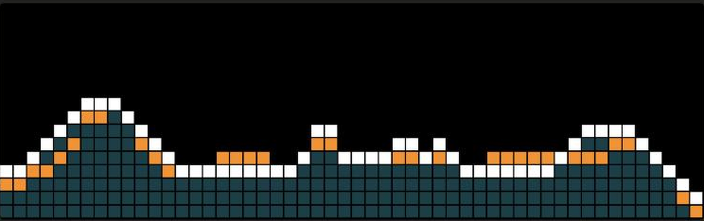
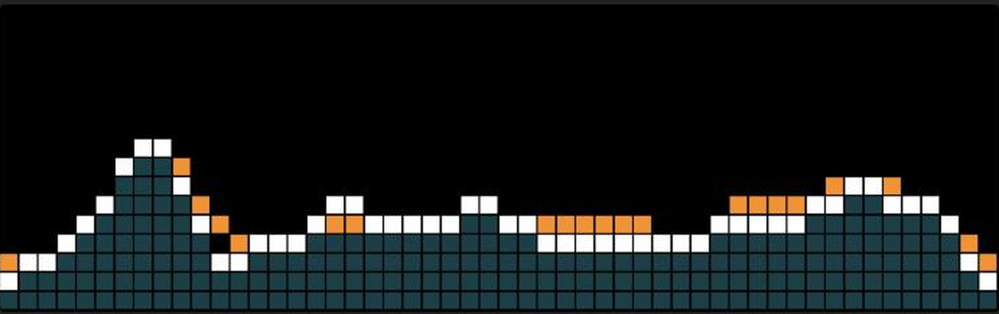
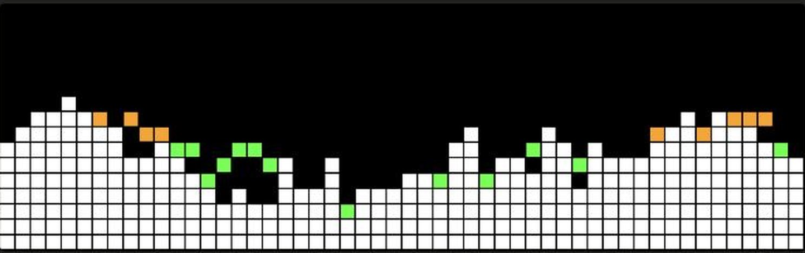

# AWTRIX EQ

Live music spectrum from your Mac on a Ulanzi TC002 pixel clock running the AWTRIX NG firmware.
Logarithmic frequency axis with fine bass resolution, up to 40 frames per second,
an idle animation when no music is playing, and automatic start at login.

**EQ 2** – smooth live curve with filled area and a slow average line:

**EQ 1** – 52 white bars with peak dots coloured green, orange and red by level:

## Requirements

- Mac with macOS 12 or newer and Python 3.9 or newer
  (check with `python3 --version` in Terminal; if missing, run `xcode-select --install`).
- Ulanzi TC002 running AWTRIX NG (the port by sanderdw, version 1.1.1-tc002.5 or newer)
  on the same Wi-Fi network. The clock's IP address is shown in its web UI under System.
- To visualise music playing on the Mac you need a virtual audio device that mirrors the output:
  **BlackHole** (free, existential.audio/blackhole) or **eqMac** (eqmac.app).
  Without one, AWTRIX EQ listens to a microphone and shows the sound in the room instead.

## Installation

1. Download the package: [awtrix-eq as ZIP](https://github.com/MUHRMEDIA/awtrix-eq/archive/refs/heads/main.zip)
   and unzip it, for example into your Downloads folder. The folder is called `awtrix-eq-main`.
2. Open Terminal (Applications → Utilities → Terminal).
3. Run, adjusting the path if needed:

       bash ~/Downloads/awtrix-eq-main/install.sh

4. The installer asks for:
   - the clock's IP address,
   - the audio source (it lists the devices; part of a name such as `BlackHole` or `eqMac` is enough),
   - the style: `v2` curve with average line (recommended) or `v1` 52 white bars.
5. On first start macOS asks for microphone access. Allow it; this also applies to virtual audio devices.

AWTRIX EQ then runs in the background and starts automatically at every login.
The clock shows an app called `spectrum`; it disappears when the Mac is off.

## Capturing music from the Mac (BlackHole)

1. Install BlackHole.
2. Open Applications → Utilities → Audio MIDI Setup.
3. Click “+” at the bottom left → “Create Multi-Output Device”, tick your speakers **and** BlackHole.
4. Select this multi-output device as the output in System Settings → Sound.
5. Enter `BlackHole` as the audio source in AWTRIX EQ.

With eqMac this is not needed: simply choose `eqMac` as the audio source.

## Changing settings

All values live in `~/Library/Application Support/awtrix-eq/config.json`:

| Key | Meaning | Default |
|---|---|---|
| `clock` | IP address of the clock | |
| `device` | audio source, part of the name or device number | |
| `style` | `v2` curve, `v1` bars, `rainbow` colourful bars | `v2` |
| `gain` | sensitivity, higher = taller bars | `1.5` |
| `tilt` | treble boost in dB per octave, 0 = flat | `4.5` |
| `fps` | target frame rate | `42` |
| `connections` | parallel connections to the clock | `3` |
| `idle_after` | seconds without music before the idle animation | `15` |

Restart after editing:

    launchctl kickstart -k gui/$(id -u)/de.awtrix-eq.analyzer

## Running manually, troubleshooting

    "$HOME/Library/Application Support/awtrix-eq/venv/bin/python" "$HOME/Library/Application Support/awtrix-eq/awtrix_eq.py" --list
    "$HOME/Library/Application Support/awtrix-eq/venv/bin/python" "$HOME/Library/Application Support/awtrix-eq/awtrix_eq.py" --style v2

A status line appears every five seconds with frame rate, level and mode.
The background log is at `~/Library/Application Support/awtrix-eq/awtrix-eq.log`.

Common causes:
- **Nothing on the clock**: check the IP address; are clock and Mac on the same Wi-Fi?
- **Bars do not follow the music**: the audio source is a microphone instead of BlackHole/eqMac.
- **Always the idle animation**: music plays through a different output device than the one selected.
- **Bars too low or permanently at the top**: adjust `gain`.

## Uninstall

    bash ~/Downloads/awtrix-eq-main/uninstall.sh

## How it works

The Mac captures the audio, computes a Fourier transform (with a longer window for the bass),
and sends one small HTTP request per frame to the clock, which only draws. The clock itself
does not listen to anything. Only the public HTTP API of AWTRIX NG and the Python libraries
numpy and sounddevice are used.
